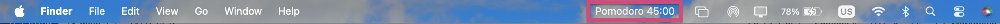

# Pomodoro for SwiftBar (macOS)

[Project page](https://oskuddar.github.io/blog/2026/pomodoro/)

A lightweight Pomodoro timer that runs directly in the macOS menu bar using SwiftBar.

Supports adjustable focus and break durations, automatic session switching, notifications, and persistent timer state.



## Features

- Menu bar Pomodoro timer
- Adjustable focus durations (30 / 45 / 60 min)
- Adjustable break durations (5 / 10 / 25 min)
- Automatic switch between focus and break sessions
- macOS notification and sound alerts
- Timer state persists after refreshes

---

## Requirements

- macOS
- Python 3
- SwiftBar

Install SwiftBar:

```bash
brew install swiftbar
```

---

## Installation

Clone the repository <b>OR</b> just download the [python code](https://github.com/oskuddar/Pomodoro_Swiftbar#:~:text=1%20minute%20ago-,pomodoro.1s.py,-Create%20pomodoro.1s):

```bash
git clone https://github.com/oskuddar/Pomodoro_Swiftbar.git
```

Create the SwiftBar plugins folder:

```bash
mkdir -p ~/SwiftBarPlugins
```

Copy the plugin:

```bash
cp pomodoro-swiftbar/pomodoro.1s.py ~/SwiftBarPlugins/
```

Make it executable:

```bash
chmod +x ~/SwiftBarPlugins/pomodoro.1s.py
```

---

## Configure Python

Open the script:

```bash
nano ~/SwiftBarPlugins/pomodoro.1s.py
```

Replace:

```python
#!/path.../bin/python3
```

with where your Python lives:

```bash
which python3
```

```python
Example: #!/usr/bin/env python3
```

Save and close.

---

## Usage

Open SwiftBar.

The menu bar will show:

```text
Pomodoro 30:00
```

Click it to:

- Start timer
- Stop timer
- Change focus duration
- Change break duration
- Reset timer

When a session ends:

- macOS notification appears
- Notification sound plays
- Timer automatically switches modes

---

## Customization

Edit these values inside `print_menu()`:

```python
[30, 45, 60]
```

for focus duration options.

Edit:

```python
[5, 10, 25]
```

for break duration options.

Change notification sound:

```python
/System/Library/Sounds/Glass.aiff
```

to any macOS system sound.

---

## Troubleshooting

Refresh SwiftBar:

```text
SwiftBar → Refresh All
```

If the timer does not appear:

```bash
chmod +x ~/SwiftBarPlugins/pomodoro.1s.py
```

Verify Python:

```bash
which python3
```

---

## License

MIT License
